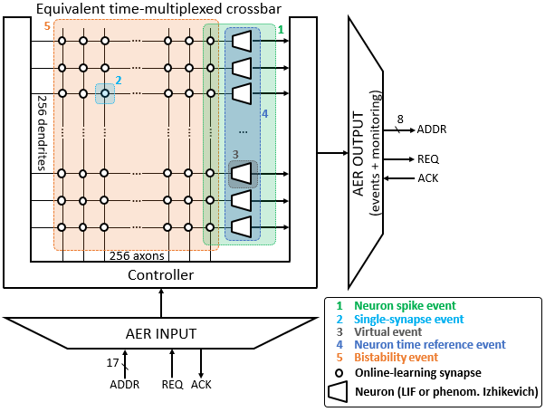
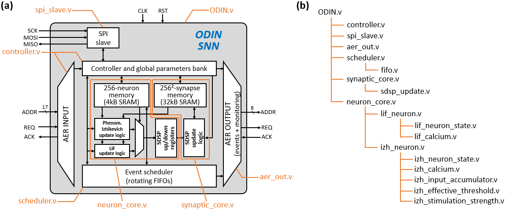
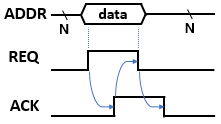
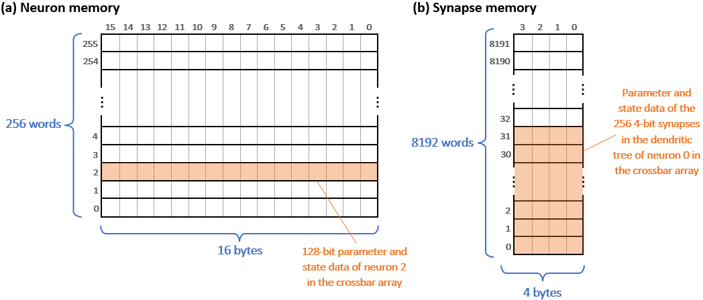
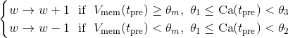
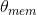
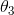

# ODIN Spiking Neural Network (SNN) Processor Documentation

> Copyright (C) 2019, Université catholique de Louvain (UCLouvain), Belgium.

> The documentation for ODIN is under a Creative Commons Attribution 4.0 International License (see [doc/LICENSE](LICENSE) file or http://creativecommons.org/licenses/by/4.0/), while the ODIN HDL source code is under a Solderpad Hardware License v2.0 (see [LICENSE](../LICENSE) file or https://solderpad.org/licenses/SHL-2.0/).

> 

> Before reading the documentation, it is strongly advised to read the ODIN [*Trans. on BioCAS* paper](#6-citing-odin) in order to have a clear overview of the ODIN SNN.

> Current documentation revision: v0.1.

## Contents

 1. [Architecture](#1-architecture)
 2. [Interfaces and commands](#2-interfaces-and-commands)
 3. [Neuron and synapse operation](#3-neuron-and-synapse-operation)
 4. [Global configuration registers](#4-global-configuration-registers)
 5. [Implementation tips](#5-implementation-tips)
 6. [Citing ODIN](#6-citing-odin)
 7. [Revision history](#7-revision-history)

## 1. Architecture

ODIN is an **o**nline-learning **di**gital spiking **n**euromorphic processor designed and prototyped in 28-nm FDSOI CMOS at Université catholique de Louvain (UCLouvain), published in 2019 in the [*IEEE Transactions on Biomedical Circuits and Systems* journal](#6-citing-odin). ODIN is based on a single 256-neuron 64k-synapse crossbar neurosynaptic core, whose crossbar architecture and block diagram are described in [Section 1.1](#11-crossbar-architecture) and [Section 1.2](#12-block-diagram-and-file-tree), respectively. ODIN has the following key features:

* synapses embed spike-dependent synaptic plasticity (SDSP)-based online learning,
* neurons can be individually chosen as a standard leaky integrate-and-fire (LIF) model or as a phenomenological Izhikevich (IZH) neuron model to reproduce the 20 Izhikevich behaviors.

ODIN is thus a versatile experimentation platform for learning at the edge, while demonstrating (i) record neuron and synapse densities compared to all previously-proposed spiking neural networks (SNNs) and (ii) the lowest energy per synaptic operation across previously-proposed digital SNNs.

### 1.1. Crossbar architecture

|  |
|:--:|
| *Fig. 1 - ODIN time-multiplexed crossbar architecture and key event types handled by the input AER link. Adapted from \[[Frenkel, 2019](#6-citing-odin)\].* |

ODIN emulates the crossbar architecture shown in Fig. 1, where each neuron is connected to all 256 neurons in the crossbar array through online-learning synapses. The crossbar core thus comprises 256x256=64k synapses. In order to reduce the circuit resources, the update logic of neurons and synapses is shared through time multiplexing: all the neuron and synapse states are stored in SRAM memories. Input and output events from/to the crossbar architecture are handled through address-event representation (AER) buses:

* for increased versatility, the input AER link allows handling different types of input events ([Section 2.2.1](#221-input-aer-bus)),
* the output AER link can be configured to automatically monitor the state of a specific neuron and an associated synapse ([Section 2.2.2](#222-output-aer-bus)).

### 1.2. Block diagram and file tree

|  |
|:--:|
| *Fig. 2 - (a) ODIN block diagram with main verilog files, adapted from \[[Frenkel, 2019](#6-citing-odin)\]. (b) Full verilog file tree, illustrating dependencies between the different modules.* |

An overview of the ODIN SNN processor block diagram is shown in Fig. 2(a), illustrating the time-multiplexed 256-neuron 64k-synapse crossbar architecture implementation. The individual states and parameters of the neurons and synapses are respectively stored in [4-kB and 32-kB single-port synchronous memories](#31-memory-organization), currently included in the HDL code as a behavioral description (see [Section 5](#5-implementation-tips) for details). Time multiplexing of the neuron and synapse update logic is handled by the controller, while internal and external events from the input AER bus are handled by the scheduler. An SPI bus allows configuring the control registers and accessing the individual neuron and synapse states. The verilog files corresponding to the main blocks are highlighted in orange in Fig. 2(a), while the detailed verilog file tree available in the [src folder](../src/) is shown in Fig. 2(b). Further details regarding the architecture and time-multiplexed operation of ODIN can be found in the associated [*Trans. on BioCAS* paper](#6-citing-odin).

## 2. Interfaces and commands

Beyond reset and clock inputs, the top-level file [ODIN.v](../src/ODIN.v) contains three main interfaces: the SPI bus ([Section 2.1](#21-spi-bus)) and the input and output AER buses ([Section 2.2](#22-address-event-representation-aer-buses)).

### 2.1. SPI bus

|  |
|:--:|
| *Fig. 3 - 20-bit SPI timing diagram for (a) write and (b) read operations.* |

ODIN implements a 20-bit slave SPI bus with the following interface:

| Pin    | Direction | Width | Description                            |
|--------|-----------|-------|----------------------------------------|
|*SCK*   | Input     | 1-bit | SPI clock generated by the SPI master. |
|*MOSI*  | Input     | 1-bit | Master output, slave input.            |
|*MISO*  | Output    | 1-bit | Master input, slave output.            |

When using the SPI bus, the *SPI\_GATE\_ACTIVITY* configuration register should be asserted ([Section 4](#4-global-configuration-registers)). In order to ensure proper operation, the SCK SPI clock should operate at a frequency at least 4x smaller than the clock frequency of ODIN. The SPI write and read operations follow the timing diagram shown in Figs. 3(a) and 3(b), respectively: a 20-bit address field is first transmitted by the SPI master, before data associated to this address is sent by the master (write) or received from ODIN (read). Depending on the contents of the 20-bit address field *a*, the SPI bus can be used to access the [configuration registers](#4-global-configuration-registers), the [neuron memory or the synapse memory](#31-memory-organization) as follows:

| *R* (*a<19>*) | *W* (*a<18>*) | *cmd<1:0>*    (*a<17:16>*) | *addr<15:0>* (*a<15:0>*) | Description                                                                                      |
|------|------|------------|--------------------------------------------|------------------------------------------------------------------------------------------------------------------|
| N/A  | N/A  |     00     | {*conf\_addr<15:0>*}                       | Configuration register write at address *conf\_addr*.                                                            |
|  1   |  0   |     01     | {n/a,*byte\_addr<3:0>*,*word\_addr<7:0>*}  | Read to the neuron memory (256 128-bit words). Byte *byte\_addr<3:0>* from word *word\_addr<7:0>* is retrieved.  |
|  0   |  1   |     01     | {n/a,*byte\_addr<3:0>*,*word\_addr<7:0>*}  | Write to the neuron memory (256 128-bit words). Byte *byte\_addr<3:0>* from word *word\_addr<7:0>* is written.   |
|  1   |  0   |     10     | {n/a,*byte\_addr<1:0>*,*word\_addr<12:0>*} | Read to the synapse memory (8192 32-bit words). Byte *byte\_addr<1:0>* from word *word\_addr<12:0>* is retrieved. |
|  0   |  1   |     10     | {n/a,*byte\_addr<1:0>*,*word\_addr<12:0>*} | Write to the synapse memory (8192 32-bit words). Byte *byte\_addr<1:0>* from word *word\_addr<12:0>* is written.  |

The 20-bit SPI data field *d* has the following form:

| *n/a<3:0>* (*d<19:16>*) | *mask<7:0>* (*d<15:8>*) | *byte<7:0>* (*d<7:0>*) | Source | Description                                                                                            |
|------------|----------------|----------------|------------|----------------------------------------------------------------------------------------------------------------------------------|
|      -     | *w\_mask<7:0>* | *w\_byte<7:0>* | SPI Master |  SPI Write - Data byte *w\_byte<7:0>* masked by *w\_mask<7:0>* (1=masked, 0=non-masked) is written to the target memory location.|
|      -     |      N/A       | *r\_byte<7:0>* | ODIN       |  SPI Read - Data byte *r\_byte<7:0>* associated to the target memory location is retrieved from ODIN.                            |

### 2.2. Address-event representation (AER) buses

|  |
|:--:|
| *Fig. 4 - AER four-phase handshake timing diagram.* |

Address-event representation (AER) buses follow a four-phase handshake protocol for asynchronous communication between neuromorphic chips, as shown in Fig. 4. As ODIN follows a synchronous digital design flow, a double-latching barrier is placed on the *REQ* line of the input AER bus and on the *ACK* line of the output AER bus in order to limit metastability issues. 

### 2.2.1 Input AER bus

The input AER bus has the following interface:

| Pin           | Direction | Width  | Description                     |
|---------------|-----------|--------|---------------------------------|
| *AERIN\_ADDR* | Input     | 17-bit | AER address field.              |
| *AERIN\_REQ*  | Input     | 1-bit  | AER request handshake line.     |
| *AERIN\_ACK*  | Output    | 1-bit  | AER acknowledge handshake line. |

The 17-bit *AERIN\_ADDR* address field accommodates for the following event types, as represented in Fig. 1:

| *ADDR<16>* | *ADDR<15:8>*     | *ADDR<7:0>*            | Event type                                       | Number of cycles | Description                                |
|------------|------------------|------------------------|--------------------------------------------------|------------------|--------------------------------------------|
|     1      | *pre\_neur<7:0>* | *post\_neur<7:0>*      | Single-synapse event                             | 2                | Stimulates neuron at address *post\_neur<7:0>* with the synaptic weight associated to pre-synaptic neuron address *pre\_neur<7:0>*. Ignores the value of the mapping table bit. |
|     0      | *neur<7:0>*      | 0xFF                   | Single-neuron time reference event               | 2                | Activates a time reference event for neuron *neur<7:0>* only. |
|     0      | N/A              | 0x7F                   | All-neurons time reference event                 | 512              | Activates a time reference event for all neurons. |
|     0      | *neur<7:0>*      | 0x80                   | Single-neuron bistability event                  | 128              | Activates a bistability event for all synapses in the dendritic tree of neuron *neur<7:0>*. |
|     0      | N/A              | 0x00                   | All-neurons bistability event                    | 32k              | Activates a bistability event for all synapses in the crossbar array. |
|     0      | *pre\_neur<7:0>* | 0x07                   | Neuron spike event                               | 1+512            | Stimulates all neurons with the synaptic weight associated to pre-synaptic neuron *pre\_neur<7:0>*. Takes the mapping table bit into account. Neuron spike events go through the scheduler (1 cycle for a push to the scheduler, 512 cycles for processing when the event is popped from the scheduler). |
|     0      | *neur<7:0>*      | {*w<2:0>*,*s*,*l*,001} | Virtual event                                    | 1+2              | Stimulates a specific neuron with weight *w<2:0>* and sign bit *s* (1: inhibitory, 0: excitatory), without activating a physical synapse. If the leak bit *l* is asserted, weight information is ignored and a time reference / leakage event is triggered in the neuron instead. Virtual events go through the scheduler (1 cycle for a push to the scheduler, 2 cycles for processing when the event is popped from the scheduler). |

The detailed operation of time reference and bistability events are described in [Section 3](#3-neuron-and-synapse-operation). It should be noted that, while Fig. 1 illustrates the all-neurons time reference and bistability events, single-neuron counterparts are available in order to save clock cycles when a small number of neurons is used in the crossbar array.

### 2.2.2. Output AER bus

The output AER bus has the following interface:

| Pin            | Direction | Width  | Description                     |
|----------------|-----------|--------|---------------------------------|
| *AEROUT\_ADDR* | Output    | 8-bit  | AER address field.              |
| *AEROUT\_REQ*  | Output    | 1-bit  | AER request handshake line.     |
| *AEROUT\_ACK*  | Input     | 1-bit  | AER acknowledge handshake line. |

In its *standard operation mode* (i.e. the *SPI\_OUT\_AER\_MONITOR\_EN* configuration register is set to 0, as defined in [Section 4](#4-global-configuration-registers)), the output AER bus allows sending off-chip events that are generated locally by the neurons in the crossbar array. When a neuron spikes, an output AER transaction is triggered and the 8-bit *AEROUT\_ADDR* address field contains the 8-bit address of the spiking neuron.

In the *non-standard monitoring mode* (i.e. the *SPI\_OUT\_AER\_MONITOR\_EN* configuration register is set to 1), the output AER bus allows monitoring state changes in a specific neuron and a specific synapse, whose addresses are defined in the configuration registers ([Section 4](#4-global-configuration-registers)). If the state of the monitored neuron changes (including the [SDSP state](#331-spike-dependent-synaptic-plasticity-sdsp-parameters)), two successive AER transactions are triggered. If the synaptic weight of the monitored synapse changes (occurs only if SDSP online learning is enabled), one output AER transaction is triggered. The output AER monitoring transactions are defined as follows:

| AER output transaction          | 8-bit *AEROUT\_ADDR* contents                    | Definitions of monitored parameters |
|---------------------------------|--------------------------------------------------|-------------------------------------|
| First neuron monitoring packet  | {*event*,*up*,*down*,*Ca<2:0>*,*res\_sign<1:0>*} | *event*: neuron spike flag. *up*: SDSP learning potentiation flag. *down*: SDSP learning depression flag. *Ca<2:0>*: 3-bit Calcium variable. *res\_sign<1:0>*: membrane potential rotation sign (only for [IZH neuron model](#333-phenomenological-izhikevich-izh-neuron-model)). |
| Second neuron monitoring packet | {*v\_mem<7:0>*}                                  | *v\_mem<7:0>*: membrane potential contents (8-bit for [LIF neuron model](#332-leaky-integrate-and-fire-lif-neuron-model), only the 4 LSBs for the [IZH neuron model](#333-phenomenological-izhikevich-izh-neuron-model)). |
| Synapse monitoring packet       | {1111,*table*,*w<2:0>*}                          | *table*: mapping table bit (changing only if reprogrammed). *w<2:0>*: synaptic weight. |

It should be noted that synapse monitoring events cannot be confused with the initiation of a neuron monitoring transaction: having both the *up* and *down* SDSP learning flag bits asserted is an illegal neuron state.

## 3. Neuron and synapse operation

As ODIN relies on time-multiplexed operation, the memory organization contains essential information for neuron and synapse handling ([Section 3.1](#31-memory-organization)). The memory contents cover state and parameter information, which are explained in [Section 3.2](#32-synapses) for the synapses and [Section 3.3](#33-neurons) for the neurons.

### 3.1 Memory organization

|  |
|:--:|
| *Fig. 5 - (a) Neuron and (b) synapse memory architectures.* |

The organization of the neuron and synapse single-port synchronous memories is shown in Fig. 5. The word and byte addresses will be used in the commands sent to the [SPI bus](#21-spi-bus) for neuron and synapse configuration and readback operations.

Fig. 5(a) shows the organization of the neuron memory, which consists of 256 128-bit words. Each neuron thus corresponds to a 128-bit word (i.e. the 8-bit word address corresponds to the address of the neuron being accessed), in which all model parameters and state information are stored. The most-significant bit (MSB) of each word allows individually disabling neurons (1: disabled, 0: enabled). The least-significant bit (LSB) of each word allows individually choosing the model of each neuron, i.e. either an 8-bit leaky integrate-and-fire (LIF) model or a phenomenological Izhikevich (IZH) neuron model. Their respective parameter and state memory organization are described in Sections [3.3.2](#332-leaky-integrate-and-fire-lif-neuron-model) and [3.3.3](#333-phenomenological-izhikevich-izh-neuron-model).

Fig. 5(b) shows the organization of the synapse memory, which consists of 8192 32-bit words. The choice of a 32-bit width was made in order to opt for SRAM macros with the highest density, the dendritic tree of a neuron thus span multiple words: as each synapse occupies 4 bits ([Section 3.2](#32-synapses)), 8 synapses are accessed per word and 32 32-bit words are required to encode the dendritic tree of a neuron. A specific synapse corresponds to the intersection of a pre-synaptic neuron (8-bit address *pre\_neur*) and a post-synaptic neuron (8-bit address *post\_neur*); the word and byte addresses of the synapse memory are thus defined as follows:

| Synapse memory address | Width  | Contents                              |
|------------------------|--------|---------------------------------------|
| Word address           | 13-bit | {*pre\_neur<7:0>*,*post\_neur<7:3>*}  |
| Byte address           | 2-bit  | *post\_neur<2:1>*                     |

In the accessed byte, *post\_neur<0>* selects which 4-bit synapse is read or written (0: least-significant half-byte, 1: most-significant half-byte). Such considerations are useful for initial configuration through [SPI](#21-SPI-bus).

### 3.2. Synapses

As described in [Section 3.1](#31-memory-organization), synapses occupy 4 bits, the MSB being the mapping table bit and the three LSBs being the 3-bit synaptic weight. Depending on the value of the configuration registers *SPI\_UPDATE\_UNMAPPED\_SYN* and *SPI\_PROPAGATE\_UNMAPPED\_SYN* ([Section 4](#4-global-configuration-registers)), the mapping table bit can be used either (i) to select which synapses are enabled (i.e. whether their synaptic weight is added to the post-synaptic neuron) or (ii) to select which synapses are plastic with [SDSP](#331-spike-dependent-synaptic-plasticity-SDSP-parameters) or static. 

SDSP potentiation and depression in the synaptic weights is triggered automatically upon pre-synaptic event spikes according to the post-synaptic neuron state ([Section 3.3.1](#331-spike-dependent-synaptic-plasticity-sdsp-parameters)), which contains the associated SDSP parameters and state. Therefore, no further parameter or state information is required at the synapse level for SDSP-based online learning: SDSP computation is offloaded to the neurons, which allows embedding online learning in all synapses at high density. 

### 3.3. Neurons

Each neuron is associated to a 128-bit word in the neuron memory, which contains its parameters and state information. Neurons have been extended in order to carry out spike-dependent synaptic plasticity (SDSP) computation and enable plasticity for synapses in their dendritic tree, the associated parameters and state information are described in [Section 3.3.1](#331-spike-dependent-synaptic-plasticity-sdsp-parameters). Neurons can be individually configured as an 8-bit leaky integrate-and-fire (LIF) model ([Section 3.3.2](#332-leaky-integrate-and-fire-lif-neuron-model)) or as a custom phenomenological Izhikevich (IZH) neuron model ([Section 3.3.3](#333-phenomenological-izhikevich-izh-neuron-model)).

Neurons can be stimulated following the different event types described in [Section 2.2.1](#221-input-aer-bus) and illustrated in Fig. 1. Both the LIF and IZH neuron models were designed to be entirely event-driven, therefore timing information is made available through dedicated time reference events. If the leakage mechanism is enabled, time reference events directly trigger leakage with configurable strength in the neurons membrane potential (see Sections [3.3.2](#332-leaky-integrate-and-fire-lif-neuron-model) and [3.3.3](#333-phenomenological-izhikevich-izh-neuron-model) for details). In order to dissociate leakage time constants for the membrane potential and the for [Calcium variable](#331-spike-dependent-synaptic-plasticity-sdsp-parameters), a configurable number of time reference events need to be accumulated to trigger Calcium leakage. While the membrane potential and Calcium leakage are the only mechanisms triggered by time reference events for the LIF neuron model, the IZH neuron model strongly relies on time reference events for the time constants of the Izhikevich behaviors.

#### 3.3.1. Spike-dependent synaptic plasticity (SDSP) parameters

The spike-dependent synaptic plasticity (SDSP) learning rule proceeds according to the following update conditions on a synaptic weight *w* each time a pre-synaptic spike is received:

Both the LIF and the IZH neuron models have been extended with SDSP computation circuitry to enable embedded SDSP-based online learning. Beyond the membrane potential , neurons contain a 3-bit Calcium variable *Ca*, which represents the recent firing activity of the neuron. Each time the neuron fires, its Calcium variable is incremented, while Calcium leakage depends on time reference events (Sections [3.3.2](#332-leaky-integrate-and-fire-lif-neuron-model) and [3.3.3](#333-phenomenological-izhikevich-izh-neuron-model)). SDSP requires four parameters: an threshold  on the membrane potential and three thresholds ,  and  on the Calcium variable.

The only SDSP mechanism that does not rely on neuron operation is bistability (optional), for which a dedicated event type has been created ([Section 2.2.1](#221-input-aer-bus)). Each time a bistability event is received, if the synaptic weight is above (resp. below) half its dynamic, it increments (resp. decrements) toward a high (resp. low) state. A detailed description of SDSP online learning is available in the [ODIN *Trans. on BioCAS* paper](#6-citing-odin).

The SDSP potentiation and depression conditions on the membrane potential and the calcium variable are agglomerated in single-bit potentiation (*up*) and depression (*down*) flags, which are stored in the SDSP UP/DOWN register bank shown in Fig. 2(a). It allows the SDSP update logic to efficiently access relevant SDSP information from the neurons.

#### 3.3.2. Leaky integrate-and-fire (LIF) neuron model

A neuron *i* behaves according to an 8-bit leaky integrate-and-fire (LIF) neuron model if the LSB of word *i* in the [neuron memory](#31-memory-organization) is asserted. If the LIF model is selected, the parameters and state information stored in a 128-bit neuron word are as follows:

| Bitwise location in word | Parameter/state | Name            | Width  | Description                                                                                                     |
|--------------------------|-----------------|-----------------|--------|-----------------------------------------------------------------------------------------------------------------|
| 0                        | Parameter       | *lif\_izh\_sel* | 1      | Selects the neuron model (1 for LIF neuron). |
| 7-1                      | Parameter       | *leak\_str*     | 7      | Defines the amount by which the membrane potential is decreased in the case of time reference / leakage event. The membrane potential cannot go negative. |
| 8                        | Parameter       | *leak\_en*      | 1      | Enables the leakage mechanism. |
| 16-9                     | Parameter       | *thr*           | 8      | Defines the firing threshold: a spike is issued and the neuron is reset when the membrane potential reaches the *thr* value. |
| 17                       | Parameter       | *ca\_en*        | 1      | Enables the Calcium variable and SDSP online learning in the dendritic tree of the current neuron. |
| 25-18                    | Parameter       | *thetamem*      | 8      | Defines the SDSP threshold on the membrane potential. |
| 28-26                    | Parameter       | *ca\_theta1*    | 3      | Defines the first SDSP threshold on the Calcium variable. |
| 31-29                    | Parameter       | *ca\_theta2*    | 3      | Defines the second SDSP threshold on the Calcium variable. |
| 34-32                    | Parameter       | *ca\_theta3*    | 3      | Defines the third SDSP threshold on the Calcium variable. |
| 39-35                    | Parameter       | *ca\_leak*      | 5      | Defines the Calcium variable leakage time constant: a number *ca\_leak* of time reference events must be accumulated for the Calcium variable to be decremented. If set to 0, disables Calcium leakage. |
| 77-70                    | State           | *core*          | 8      | Contains the current value of the membrane potential. |
| 80-78                    | State           | *calcium*       | 3      | Contains the current value of the Calcium variable. |
| 85-81                    | State           | *caleak\_cnt*   | 5      | Contains the current value of the Calcium variable leakage counter (cfr. *ca\_leak* parameter). |
| 127                      | Parameter       | *neur\_disable* | 1      | Disables the neuron. |

#### 3.3.3. Phenomenological Izhikevich (IZH) neuron model

A neuron *i* behaves according to a custom phenomenological Izhikevich (IZH) neuron model if the LSB of word *i* in the [neuron memory](#31-memory-organization) is de-asserted. The architecture is described in the [ODIN *Trans. on BioCAS* paper](#6-citing-odin). Detailed parameter, state and operation information on the IZH neuron model will appear in a future revision of this documentation. Not using the IZH neuron models does not preclude from using ODIN, neurons can be operated with the [LIF neuron model](#332-leaky-integrate-and-fire-lif-neuron-model) instead.

### 4. Global configuration registers

Configuration registers can be written through the SPI bus (no readback operation is available) and do not have a default reset value: they need to be programmed after each power cycle and are defined as follows:

| Register Name                  |Addr<15:0>| Width | Description                     | 
|--------------------------------|----------|-------|---------------------------------|
|*SPI\_GATE\_ACTIVITY*           | 0        | 1-bit | Gates the network activity and allows the SPI to access the neuron and synapse memories for programming and readback. |
|*SPI\_OPEN\_LOOP*               | 1        | 1-bit | Prevents spike events generated locally by the neuron array from entering the scheduler, they will thus not be processed by the controller and the scheduler only handles events received from the input AER interface. Locally-generated spike events can still be transmitted by the output AER interface if the *SPI\_AER_SRC\_CTRL\_nNEUR* configuration register is de-asserted. |
|*SPI\_SYN\_SIGN*                | 2-17     |256-bit| Configures each of the 256 ODIN neurons as either inhibitory (1) or excitatory (0), i.e. all of their downstream synapses either take a negative (1) or positive (0) sign. |
|*SPI\_BURST\_TIMEREF*           | 18       |20-bit | Defines the number of clock cycles required to increment the scheduler inter-spike-interval counter. Useful only if the neuron bursting behavior is used ([Section 3.3.3](#333-phenomenological-izhikevich-izh-neuron-model)), otherwise this register should be set to 0 to save power in the scheduler. |
|*SPI\_AER\_SRC\_CTRL\_nNEUR*    | 19       | 1-bit | Defines the source of the AER output events when a neuron spikes: either directly from the neuron when the event is generated (0) or from the controller when the event is processed (1). This distinction is of importance especially if *SPI\_OPEN\_LOOP* is asserted. |
|*SPI\_OUT\_AER\_MONITOR\_EN*    | 20       | 1-bit | Enables automatic neuron and synapse state monitoring through the AER output link ([Section 2.2.2](#222-output-aer-bus)). |
|*SPI\_MONITOR\_NEUR\_ADDR*      | 21       | 8-bit | Neuron address to be monitored if *SPI\_OUT\_AER\_MONITOR\_EN* is asserted. |
|*SPI\_MONITOR\_SYN\_ADDR*       | 22       | 8-bit | Synapse address of the post-synaptic neuron *SPI\_MONITOR\_NEUR\_ADDR* to be monitored if *SPI\_OUT\_AER\_MONITOR\_EN* is asserted. |
|*SPI\_UPDATE\_UNMAPPED\_SYN*    | 23       | 1-bit | Allows SDSP online learning to be carried out in all synaptic weights, even in synapses whose mapping table bit is disabled ([Section 3.3.1](#331-spike-dependent-synaptic-plasticity-SDSP-parameters)). |
|*SPI\_PROPAGATE\_UNMAPPED\_SYN* | 24       | 1-bit | Allows all the synaptic weights to be propagated to their post-synaptic neuron, independently of the mapping table bit value. |
|*SPI\_SDSP\_ON\_SYN\_STIM*      | 25       | 1-bit | Enables SDSP online learning for synapse events ([Section 2.2.1](#221-input-aer-bus)). |

## 5. Implementation tips

When implementing ODIN or adapting it for a particular application, care should be taken with the following points:

* The provided verilog code can directly be simulated with behavioral simulation. For implementation, the behavioral descriptions of the neuron and synapse single-port synchronous SRAMs (in [neuron\_core.v](../src/neuron_core.v) and in [synaptic\_core.v](../src/synaptic_core.v), respectively) need to be replaced with SRAM macros. Block RAM (BRAM) instances can be used for FPGA implementations.

* While the state and parameters of the IZH neuron model fully occupy the 128-bit words of the neuron memory, the 8-bit LIF neuron model occupies only 57 bits out of 128 in the neuron memory words. Therefore, the LIF model can easily be extended with a higher membrane potential resolution or with more features.

* The different verilog modules contain as parameters N and M, where N represents the number of neurons in the crossbar array and M is log2(N). These parameters help rescaling ODIN to different crossbar dimensions (e.g., see [here](https://arxiv.org/pdf/1904.08513.pdf) the example of MorphIC, our second neuromorphic processor with 512 neurons per core), however the datapath is not entirely generic in N and M and further adaptations are needed if the crossbar dimensions are changed.

* The neuron disable bit (i.e. the MSB of each word in the neuron memory, cfr. [Section 3.1](#31-memory-organization)) only disables the spike generation mechanism. This feature is useful if one wants to monitor the state of a neuron while disabling its contributions to network activity. However, if the disabled neuron is unused, it comes at the cost of a power overhead as the update logic and memory accesses are not disabled: an update in the controller finite-state-machine is required to alleviate this behavior.

## 6. Citing ODIN

Upon usage of the documentation or source code, please cite the *Trans. on BioCAS* paper associated to ODIN (also available [here](https://arxiv.org/pdf/1804.07858.pdf)):

> C. Frenkel, M. Lefebvre, J.-D. Legat and D. Bol, "A 0.086-mm² 12.7-pJ/SOP 64k-Synapse 256-Neuron Online-Learning Digital Spiking Neuromorphic Processor in 28-nm CMOS," IEEE Transactions on Biomedical Circuits and Systems, vol. 13, no. 1, pp. 145-158, 2019.

## 7. Revision history

| Rev    | Date         | Author     | Description                           |
|--------|--------------|------------|---------------------------------------|
|  0.1   | 20 Apr. 2019 | C. Frenkel | First draft                           |

Future revisions will include a detailed description of the [phenomenological Izhikevich neuron model](#333-phenomenological-izhikevich-izh-neuron-model) state and parameters.

